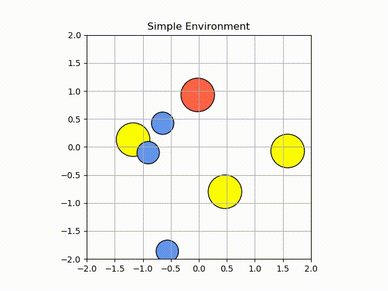

# Modular Testbed for Multi-Agent Task Allocation

This project creates a testbed for multi-agent task allocation strategies using a modular structure (inspired by OpenAI Gym). The main components of this structure are laid out below.

### Usage

from the task-allocation directory, run `python3 simple_experiment.py`

The `simple_experiment` is a script that instantiates the testbed, assembling the modules together and running the experiment. At the top, we import a `...params.py` file. These parameter files include experiment-specific data, such as number of agents and tasks, locations of the agents and tasks, dependencies of the tasks, etc. This param file is the passed into the `simple_environment` instantiation, where simulation takes place. 

The `one_to_one_params` file includes an experiment with 3 robots and 3 tasks. It is a one-to-one assignment test. The `dependency_test_params` file includes an experiment with 3 robots and 4 tasks, and one dependency (task 4 on task 1).

### Environments
The environment files hold simple simulation environments for the robot systems. They include a step function to calculate dynamics, and hold the state of the robots in the system, the state of tasks/goals and relevant constraints, and other information such as obstacle location. (TODO: maybe this should be structured as an "experiment" that holds task/goal info and constraints, so different scenarios can be run on the same environment.)

### Planners
Planner modules compute the task allocation, through any method. They receive robot and task state information from the environment, and use it to assign a set of tasks to each robot, and an order of task completion or time windows, if required by the experiment. This assignment is returned to the environment. The new planner"centralized planner6.22.2200" is able to allocate tasks based on C-CAPT algorithm. The user can change the number of robot as well as number of task in one_to_one_params.py / dependency_test_params.py to customize the program.

### Controllers
Controller modules take the state and goal information from the environment and compute control commands to take the robot from its initial position along a path to its goals. Controllers can be centralized, or set up to mimic a decentralized system in which robots only use local information.

### Supervisors
(TODO:) Supervisor modules wrap the controller and planner modules, and perform real-time supervision of the system. It can order re-planning, change control inputs to the robots (to avoid collisions, for example), and perform task swaps, among any other required capabilities.

### todos:
* [ ] make "reset" function for environment
* [ ] figure out if need to pass environment into planner/controller
